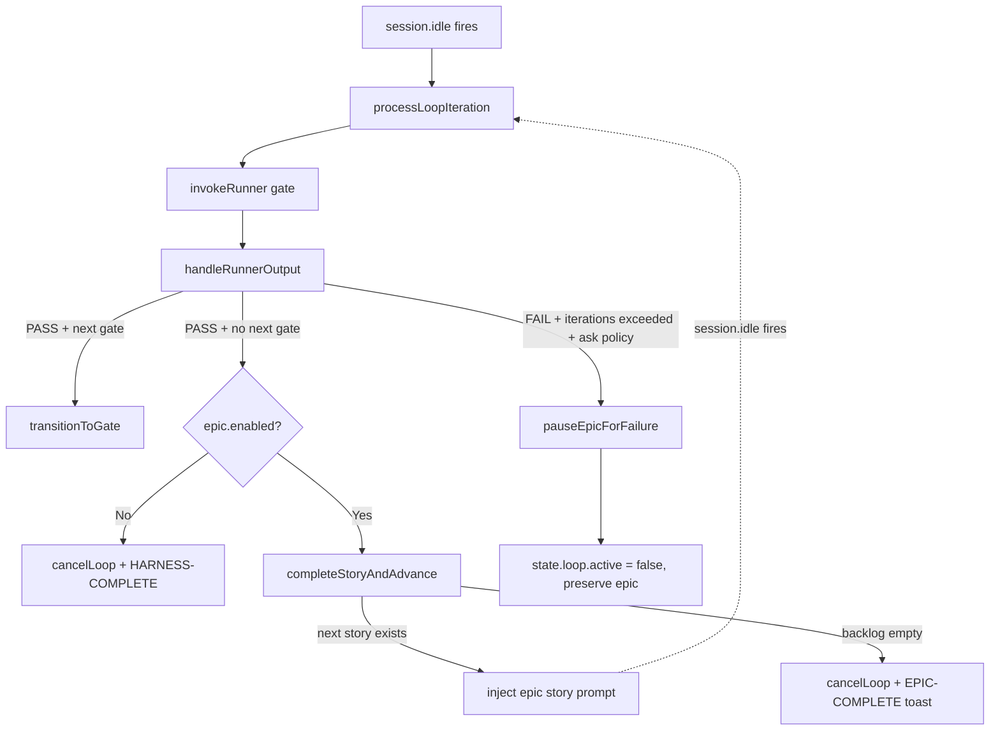

# Design: Epic Mode

## Overview

Epic mode is an **optional** outer-loop wrapper around the existing per-story gate machine. When activated via `/harness-on --epic [path]`, the plugin:

1. Loads a backlog (file adapter v1)
2. Topo-sorts stories by `depends_on`
3. Drives each story through the existing 5-gate cycle
4. On story PASS → advances to next ready story, resets per-story counters
5. On story FAIL with `ask` policy → pauses epic, exits loop, preserves state
6. On backlog complete → emits `HARNESS-COMPLETE`

The existing single-story code path is unchanged. Epic mode activates only when `state.loop.epic?.enabled === true`.

---

## State Schema Extension

### New schemas (additions to `types.ts`)

```typescript
export const StoryStatusSchema = z.enum([
  "pending",       // not started
  "in_progress",   // currently executing
  "completed",     // next-ready PASS
  "failed",        // exhausted retries
  "blocked",       // BLOCKED gate
  "skipped",       // user-skipped (Phase 2)
]);

export const BacklogStorySchema = z.object({
  id: z.string(),                              // unique within epic
  title: z.string(),
  feature_id: z.string().optional(),           // maps to LoopMeta.feature_id
  issue_number: z.number().optional(),
  story: z.string().optional(),                // prose, injected into agent prompt
  depends_on: z.array(z.string()).default([]),
});

export const BacklogSchema = z.object({
  epic_id: z.string(),
  title: z.string().optional(),
  stories: z.array(BacklogStorySchema).min(1),
});

export const EpicProgressEntrySchema = z.object({
  story_id: z.string(),
  status: StoryStatusSchema,
  started_at: z.string().optional(),     // ISO 8601
  completed_at: z.string().optional(),
  gate_reached: z.string().optional(),   // last gate before failure/completion
});

export const EpicMetaSchema = z.object({
  enabled: z.literal(true),              // presence => enabled; explicit literal prevents partial states
  epic_id: z.string(),
  current_story_id: z.string().nullable(),
  story_progress: z.array(EpicProgressEntrySchema).default([]),
  backlog_snapshot: BacklogSchema,       // frozen at startLoop
  failure_policy: z.enum(["ask"]),       // v1: only "ask"
  max_iterations_per_epic: z.number().default(500),
  epic_iteration_total: z.number().default(0),
});

export const EpicConfigSchema = z.object({
  backlog_source: z.enum(["file"]).default("file"),
  backlog_file: z.string().default(".opencode/harness.epic.json"),
  failure_policy: z.enum(["ask"]).default("ask"),
  max_iterations_per_epic: z.number().default(500),
});
```

### LoopMeta extension

```typescript
// In LoopMeta interface and LoopMetaSchema:
export interface LoopMeta {
  // ... all existing fields unchanged ...
  epic?: EpicMeta;  // absent = single-story mode
}

export const LoopMetaSchema = z.object({
  // ... all existing fields unchanged ...
  epic: EpicMetaSchema.optional(),
});
```

### HarnessConfig extension

```typescript
export const HarnessConfigSchema = z.object({
  // ... all existing fields unchanged ...
  epic: EpicConfigSchema.optional(),  // absent = epic mode unavailable
}).strict();
```

**Migration:** None required. Optional field — old state files parse fine. (Precedent: `parallel-gate-execution`.)

---

## Backlog File Format

`.opencode/harness.epic.json`:

```json
{
  "epic_id": "EPIC-24",
  "title": "Postgres migration",
  "stories": [
    {
      "id": "STORY-24-0",
      "title": "PG governance setup",
      "feature_id": "feat/24-0-pg-governance",
      "issue_number": 240,
      "story": "Set up governance for the Postgres migration ...",
      "depends_on": []
    },
    {
      "id": "STORY-24-1",
      "title": "PG Alembic baseline",
      "feature_id": "feat/24-1-pg-alembic-baseline",
      "depends_on": ["STORY-24-0"]
    },
    {
      "id": "STORY-24-2",
      "title": "PG code port",
      "feature_id": "feat/24-2-pg-code-port",
      "depends_on": ["STORY-24-1"]
    }
  ]
}
```

Validation rules (enforced in `FileBacklogAdapter.load()` + `topologicalSort()`):
- `stories[].id` must be unique within the array
- Every `depends_on` reference must exist in the same backlog
- No cycles
- `stories.length >= 1`

---

## Adapter Pattern

```typescript
// backlog-adapter.ts (new file)
export interface BacklogAdapter {
  load(): Promise<Backlog>;
}

export class FileBacklogAdapter implements BacklogAdapter {
  constructor(private readonly filePath: string) {}

  async load(): Promise<Backlog> {
    if (!existsSync(this.filePath)) {
      throw new HarnessConfigError(
        `Epic backlog file not found: ${this.filePath}`
      );
    }
    let raw: string;
    try {
      raw = readFileSync(this.filePath, "utf-8");
    } catch (e) {
      throw new HarnessConfigError(
        `Could not read backlog file ${this.filePath}: ${(e as Error).message}`
      );
    }
    let parsed: unknown;
    try {
      parsed = JSON.parse(raw);
    } catch (e) {
      throw new HarnessConfigError(
        `Backlog file is not valid JSON (${this.filePath}): ${(e as Error).message}`
      );
    }
    const result = BacklogSchema.safeParse(parsed);
    if (!result.success) {
      throw new HarnessConfigError(
        `Backlog file schema validation failed: ${result.error.message}`,
        result.error
      );
    }
    // Check unique IDs
    const ids = new Set<string>();
    for (const s of result.data.stories) {
      if (ids.has(s.id)) {
        throw new HarnessConfigError(
          `Duplicate story id "${s.id}" in backlog ${this.filePath}`
        );
      }
      ids.add(s.id);
    }
    return result.data;
  }
}

export function createBacklogAdapter(config: EpicConfig): BacklogAdapter {
  switch (config.backlog_source) {
    case "file":
      return new FileBacklogAdapter(config.backlog_file);
    default:
      throw new HarnessConfigError(
        `Unknown backlog source: ${config.backlog_source}`
      );
  }
}
```

---

## Topological Sort

```typescript
// topological-sort.ts (new file)
export function topologicalSort(stories: BacklogStory[]): BacklogStory[] {
  const storyMap = new Map<string, BacklogStory>();
  const graph = new Map<string, Set<string>>();
  const inDegree = new Map<string, number>();

  for (const s of stories) {
    storyMap.set(s.id, s);
    graph.set(s.id, new Set());
    inDegree.set(s.id, 0);
  }

  for (const s of stories) {
    for (const dep of s.depends_on) {
      if (!storyMap.has(dep)) {
        throw new HarnessConfigError(
          `Story "${s.id}" depends on "${dep}" which does not exist in the backlog`
        );
      }
      graph.get(dep)!.add(s.id);
      inDegree.set(s.id, (inDegree.get(s.id) ?? 0) + 1);
    }
  }

  const queue: string[] = [];
  for (const [id, deg] of inDegree) {
    if (deg === 0) queue.push(id);
  }

  const sorted: BacklogStory[] = [];
  while (queue.length > 0) {
    const id = queue.shift()!;
    sorted.push(storyMap.get(id)!);
    for (const neighbor of graph.get(id) ?? []) {
      const nd = inDegree.get(neighbor)! - 1;
      inDegree.set(neighbor, nd);
      if (nd === 0) queue.push(neighbor);
    }
  }

  if (sorted.length !== stories.length) {
    const remaining = stories.filter(s => !sorted.find(x => x.id === s.id))
                             .map(s => s.id);
    throw new HarnessConfigError(
      `Dependency cycle detected among stories: ${remaining.join(", ")}`
    );
  }

  return sorted;
}
```

Called **once** at `/harness-on --epic` start. Result is stored in `epic.backlog_snapshot.stories` in sorted order.

---

## Story Advancement Logic

In `loop-state-controller.ts`:

```typescript
function completeStoryAndAdvance(): { nextStoryId: string } | null {
  const state = getState();
  if (!state?.loop.active || !state.loop.epic?.enabled) return null;

  const epic = state.loop.epic;
  const completedAt = new Date().toISOString();

  // Mark current as completed
  const currentEntry = epic.story_progress.find(
    e => e.story_id === epic.current_story_id
  );
  if (currentEntry) {
    currentEntry.status = "completed";
    currentEntry.completed_at = completedAt;
    currentEntry.gate_reached = state.loop.current_gate;
  }

  // Epic-wide cap check
  if (epic.epic_iteration_total >= epic.max_iterations_per_epic) {
    pauseEpicForFailure(state, "max_iterations_per_epic exceeded");
    return null;
  }

  // Find next ready story
  const finishedIds = new Set(
    epic.story_progress
        .filter(e => e.status === "completed")
        .map(e => e.story_id)
  );
  const blockedIds = new Set(
    epic.story_progress
        .filter(e => ["failed", "blocked", "skipped"].includes(e.status))
        .map(e => e.story_id)
  );

  const nextStory = epic.backlog_snapshot.stories.find(s =>
    !finishedIds.has(s.id) &&
    !blockedIds.has(s.id) &&
    s.id !== epic.current_story_id &&
    s.depends_on.every(d => finishedIds.has(d))
  );

  if (!nextStory) {
    // Backlog drained (or remaining stories blocked by failed deps)
    return null;
  }

  // RESET per-story state
  state.loop.gate_iteration = 1;
  state.loop.current_gate = state.loop.config_snapshot.gates[0]!;
  state.loop.no_progress_count = 0;
  state.loop.same_error_history = {};
  state.loop.parallel_watchers = {};
  state.loop.last_runner_output = null;
  state.loop.verification_pending = false;

  // Increment epic-wide counter (separate from total_iteration which is gate-level)
  state.loop.epic.epic_iteration_total += 1;

  // Set new story context
  state.loop.epic.current_story_id = nextStory.id;
  state.loop.epic.story_progress.push({
    story_id: nextStory.id,
    status: "in_progress",
    started_at: completedAt,
  });

  // Update top-level fields for runner compat
  state.feature_id = nextStory.feature_id ?? null;
  state.issue_number = nextStory.issue_number ?? null;
  state.story = nextStory.story ?? null;
  state.checkpoints = {};  // fresh checkpoints per story

  writeState(statePath, state);
  return { nextStoryId: nextStory.id };
}

function pauseEpicForFailure(state: HarnessLoopState, reason: string): void {
  if (!state.loop.epic) return;
  const entry = state.loop.epic.story_progress.find(
    e => e.story_id === state.loop.epic!.current_story_id
  );
  if (entry) {
    entry.status = "failed";
    entry.gate_reached = state.loop.current_gate;
  }
  state.loop.active = false;  // exit loop, preserve epic state
  writeState(statePath, state);
}
```

### State reset table

| Field | Reset on story advance? |
|---|---|
| `gate_iteration` | ✅ Yes → 1 |
| `current_gate` | ✅ Yes → `gates[0]` |
| `no_progress_count` | ✅ Yes → 0 |
| `same_error_history` | ✅ Yes → `{}` |
| `parallel_watchers` | ✅ Yes → `{}` |
| `last_runner_output` | ✅ Yes → null |
| `verification_pending` | ✅ Yes → false |
| `checkpoints` (state-level) | ✅ Yes → `{}` |
| `total_iteration` | ❌ No (gate-level safety brake remains) |
| `epic.*` | ❌ No |
| `epic.epic_iteration_total` | ⬆️ +1 per advance |
| `override_active` | ❌ No (session-level) |
| `message_count_at_start` | ❌ No (session-level) |
| `config_snapshot` | ❌ No (immutable per epic) |

---

## Event Handler Flow



Lines to modify in `harness-loop-event-handler.ts`:

| Current line | Change |
|---|---|
| ~547-554 (PASS, no next gate) | Add `if (epic.enabled) call advance` branch |
| ~607-611 (SKIP, no next gate) | Same pattern as PASS |
| ~329-340 (max gate iter, hybrid/ask) | If `epic.enabled` → call `pauseEpicForFailure` instead of `cancelLoop` |

---

## CLI Surface

### `/harness-on`

| Form | Behavior |
|---|---|
| `/harness-on` | Single-story mode (current behavior, unchanged) |
| `/harness-on --epic` | Epic mode, default backlog file `.opencode/harness.epic.json` |
| `/harness-on --epic=<path>` | Epic mode, custom backlog file |
| `/harness-on --epic --resume` | Resume epic from preserved state. Re-runs current gate from iteration 0. Fails if no preserved epic state. |
| `/harness-on --force` | Existing: ignore cache. Compatible with `--epic`. |

Validation at `/harness-on --epic` start (before any gate runs):
1. Load backlog via adapter → JSON valid, schema valid, IDs unique
2. Topo sort → no cycles, no missing deps
3. If `--resume`: verify preserved `epic` exists in state file, current_story_id is in backlog
4. Snapshot backlog into `state.loop.epic.backlog_snapshot`

### `/harness-off`

| Form | Behavior |
|---|---|
| `/harness-off` | Preserve `epic` in state. Sets `loop.active = false`. Cancels in-flight watchers. (Different from v305: previously called `clearLoopBlock` which wiped everything.) |
| `/harness-off --clean` | Full wipe (current v305 behavior). |

**Backward compat:** Code that calls `clearLoopBlock()` directly (test fixtures) still works. The `--clean` flag is the new public API for full wipe.

---

## Configuration Schema Example

```json
{
  "runner_path": "./scripts/harness-check.sh",
  "gates": ["pre-work", "in-progress", "pre-merge", "post-merge", "next-ready"],
  "fail_policy": "hybrid",
  "max_iterations_per_gate": 10,
  "max_total_iterations": 100,
  "epic": {
    "backlog_source": "file",
    "backlog_file": ".opencode/harness.epic.json",
    "failure_policy": "ask",
    "max_iterations_per_epic": 500
  }
}
```

**Note:** Presence of `epic` block in config means epic mode is **available**. Activation still requires `--epic` flag on `/harness-on`. Without the flag, single-story mode is used.

---

## Crash Recovery

State file after crash:
```json
{
  "loop": {
    "active": true,
    "current_gate": "pre-merge",
    "gate_iteration": 3,
    "epic": {
      "enabled": true,
      "epic_id": "EPIC-24",
      "current_story_id": "STORY-24-2",
      "story_progress": [
        { "story_id": "STORY-24-0", "status": "completed", ... },
        { "story_id": "STORY-24-1", "status": "completed", ... },
        { "story_id": "STORY-24-2", "status": "in_progress", ... }
      ],
      "backlog_snapshot": { ... },
      "epic_iteration_total": 2
    }
  }
}
```

`/harness-on --epic --resume`:
1. Read state file
2. Verify `epic.enabled === true`
3. Verify `current_story_id` exists in `backlog_snapshot.stories`
4. Reset `gate_iteration` to 0 (idempotent re-run of current gate)
5. Re-inject opening prompt for current story
6. Continue loop

**Why re-run from iteration 0, not iteration N?** Gates are idempotent by contract. Running `pre-merge` (tsc + vitest + grep + npm pack) twice is fine. Continuing from iteration N risks state mismatch.

**Why not detect "PR already merged"?** Plugin doesn't track git. Runner's `post-merge` gate handles "working tree clean" check. If PR is merged and tree is clean, gate passes immediately. No special-case logic needed in the plugin.

---

## Observability (v1)

Toast messages:

| Event | Toast |
|---|---|
| Epic start | `🚀 Epic "EPIC-24" started: 5 stories. First: "STORY-24-0".` |
| Story complete + advance | `✅ Story "STORY-24-2" done → next "STORY-24-3" (3/5)` |
| Story fail + pause | `⏸️ Story "STORY-24-2" PAUSED at gate "pre-merge". Use /harness-on --epic --resume after fix.` |
| Epic-wide cap hit | `⏸️ Epic paused: max_iterations_per_epic (500) reached.` |
| Epic complete | `🏆 Epic "EPIC-24" complete! 5/5 stories done.` |
| Resume | `▶️ Resuming epic "EPIC-24" at story "STORY-24-2" gate "pre-merge".` |

State file's `epic.story_progress` IS the audit trail. No separate log file in v1.

---

## File Change Map

| File | Lines added | Lines changed |
|---|---|---|
| `types.ts` | +60 (5 new schemas + extension) | ~5 |
| `backlog-adapter.ts` (NEW) | ~50 | 0 |
| `topological-sort.ts` (NEW) | ~50 | 0 |
| `loop-state-controller.ts` | +80 | ~10 |
| `harness-loop-event-handler.ts` | +30 | ~15 (PASS/SKIP/FAIL paths) |
| `commands/harness-on.ts` | +40 | ~10 |
| `commands/harness-off.ts` | +15 | ~5 |
| `templates/epic-story-prompt.ts` (NEW) | ~40 | 0 |
| `templates/epic-completion-prompt.ts` (NEW) | ~20 | 0 |
| `constants.ts` | +2 | 0 |
| `tests/epic-mode.test.ts` (NEW) | ~400 | 0 |
| `docs/HARNESS.md` | +30 | 0 |
| `README.md` | +60 | 0 |

Total: ~900 LOC new + minor edits.

---

## Edge Cases (covered in tests)

| # | Case | Test |
|---|---|---|
| 1 | Backlog with 1 story → behaves like single-story mode | `tests/epic-mode.test.ts > single-story epic` |
| 2 | Cycle detection (A→B→A) | `> cycle detected` |
| 3 | Missing dep reference | `> missing dep error` |
| 4 | Duplicate story IDs | `> duplicate id error` |
| 5 | Empty stories array | rejected by Zod `.min(1)` |
| 6 | All stories fail → epic stops with paused state | `> all stories fail` |
| 7 | Story 3 depends on failed story 2 → unreachable, epic done with progress map | `> blocked by dep failure` |
| 8 | `/harness-off` without `--clean` preserves epic | `> off preserves epic` |
| 9 | `/harness-off --clean` wipes everything | `> off --clean wipes` |
| 10 | `--resume` without preserved epic → error | `> resume without state` |
| 11 | `--resume` with mismatched current_story_id | `> resume validates story` |
| 12 | Backlog JSON malformed | `> malformed json error` |
| 13 | Backlog file missing | `> missing file error` |
| 14 | Single-story `/harness-on` regression | `> non-epic regression` |
| 15 | Epic-wide iteration cap | `> max_iterations_per_epic` |
| 16 | Re-entry via session.idle after story advance | integration-style |

---

## Validation Ladder (for implementation PR)

Standard per `docs/HARNESS.md`:
- `tsc --noEmit` clean
- `vitest run` — existing 132 tests pass + ≥15 new = ≥147 total
- No `as any`, `@ts-ignore`, `@ts-expect-error`
- `npm pack --dry-run` includes new files
- E2E smoke test: simulate 3-story backlog with deps, verify auto-advance + final EPIC-COMPLETE
- Auto-merge Policy applies (6 preconditions)

Lane: **high-risk** initially (touches `LoopMeta` schema, gate semantics, CLI surface). After review confirms `epic` is purely additive (optional field), lane may downgrade to **normal**. Default = treat as high-risk for safety.
